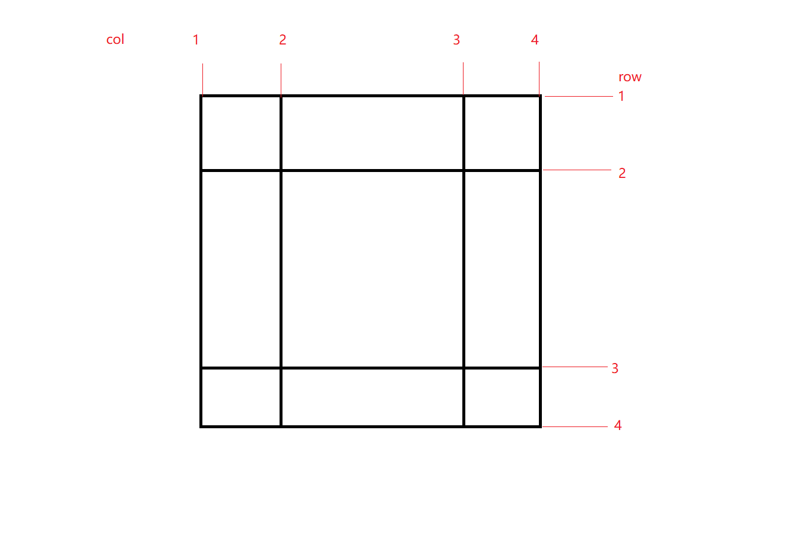

#基于vue的多层级布局组件
##安装
```
npm install gc-layout
```
##使用
```
import gcLayout from 'gc-layout'·
```
支持全局注册组件
在main.js中
```
Vue.use(gcLayout,option)
```
option可不传,或者传以下参数
+ gap 给所有的所有的网格设置间距
```
option={
  gap: ['5px', '5px']
}
```
组件中使用即可
```
 <gc-layout class="layout" :base="base" :layout="layout">
     ...内容
      <div data-to="a">内容a</div>
      <div data-to="b">内容b</div>
 </gc-layout>
```
组件接收两个参数，另外用data-to和配置中的name对应关联
```
base={
   col: ['100px', 'auto', '100px'],
   row: ['100px', 'auto', '100px'],
   gap:['10px','10px']
}
```
col 和 row 的数组长度会把layout分成网格，如上则为3X3的网格
-----

+ base的基础用法，可接受具体的px，百分比，rem，em等css单位也可以设置为auto 自动扩展
+ gap 设置网格间距，第一个参数为行间距，第二个参数为列间距，layout中会覆盖全局的gap
```
layout=[
    {
         name: 'a',
         row: [1, 'span 2'],
         col: [2, 2],
         style: {
            padding: '20px'
         },
        // 可以传入style内联样式
        // 可以增加base，layout属性 自动嵌套
    },
    {
         name: 'b',
         row: [2, 3],
         col: [2, 3]
    }
]
```

layout 内容区域设置
 + name用于 标识内容与data-to关联
 + row数组用于 控制内容占用从网格第几个横线到第几个横线的区域
 + col数组用于 标识内容占用从网格第几个竖线到第几个竖线的区域
 + row和col的数组里面 可以用 'span 数字' 表示跨几个线，比如这里span 2 表示第一根线开始，跨2根线后结束
 + base 如果内容区域还是要用网格布局方式传入,参数与第一层相同
 + layout 如果内容区域还是要用网格布局方式传入,参数与第一层相同
